## Ethereum Dapp for Tracking Items through Supply Chain(Udacity)

#### In this dapp, there are 4 roles: farmer, distriutor, retailer and consumer. Here the farmer harvests, processes, packs and sells coffee beans to distributor.The distributor buys and ships them to retailer. Finally, retailer receives them and consumer purchases the coffee beans. Here roles contract in accesscontrol is used to add, remove role's access to contracts.(FarmerRole.sol, DistributorRole.sol, RetailerRole.sol, ConsumerRole.sol)

#### Activity Diagram

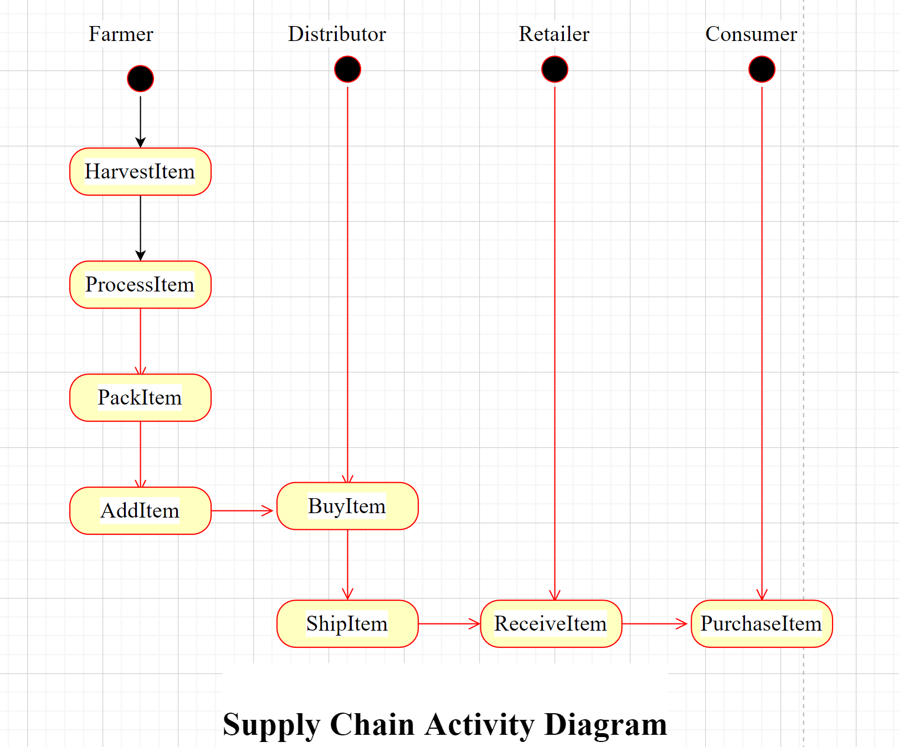

#### Sequence Diagram

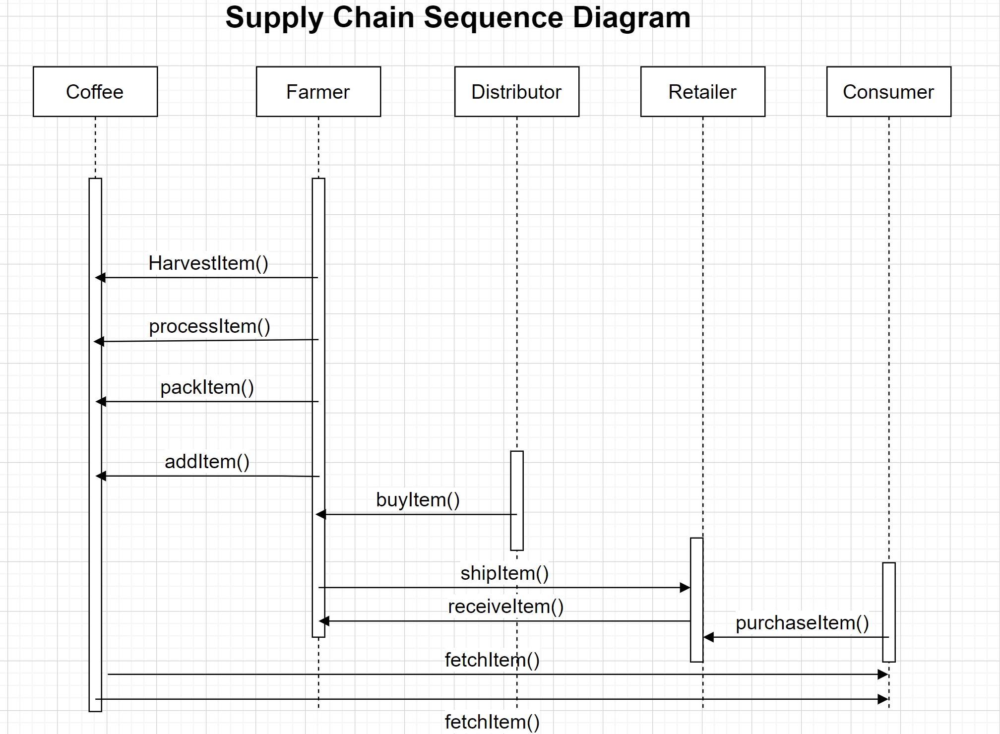

#### State Diagram

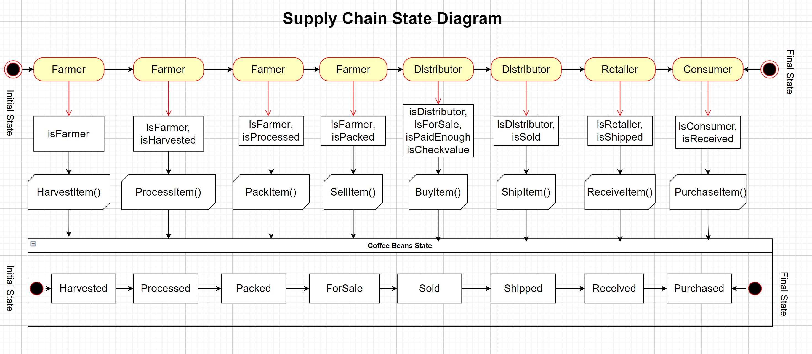

#### Class Diagram

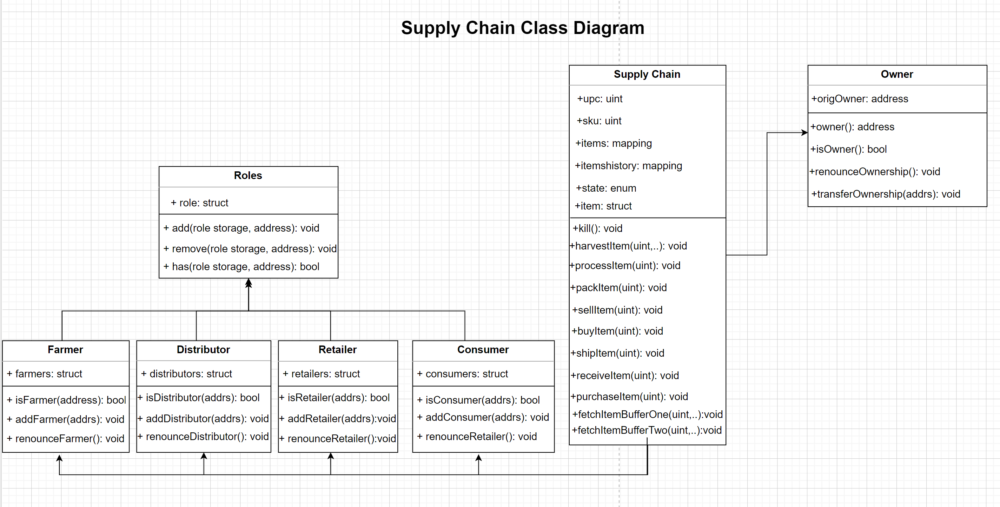

#### For this Dapp, we need the following

    To install truffle run command: npm install -g truffle 

#### Truffle version:Truffle v5.4.18, Solidity v0.5.16, Node v14.17.5 and Web3.js v1.5.3

#### Make sure you have Infura account, MetaMask installed, Ganache cli installed and ether in rinkeby account

#### Clone the repository and run cd project-6

    Run commands: npm init and npm install

    Run npm install web3 and npm install --save truffle-hdwallet-provider@1.0.17

#### Launch ganache :

    ganache-cli -m "spirit supply whale amount human item harsh scare congress discover talent hamster" 

#### Your terminal should look something like this:

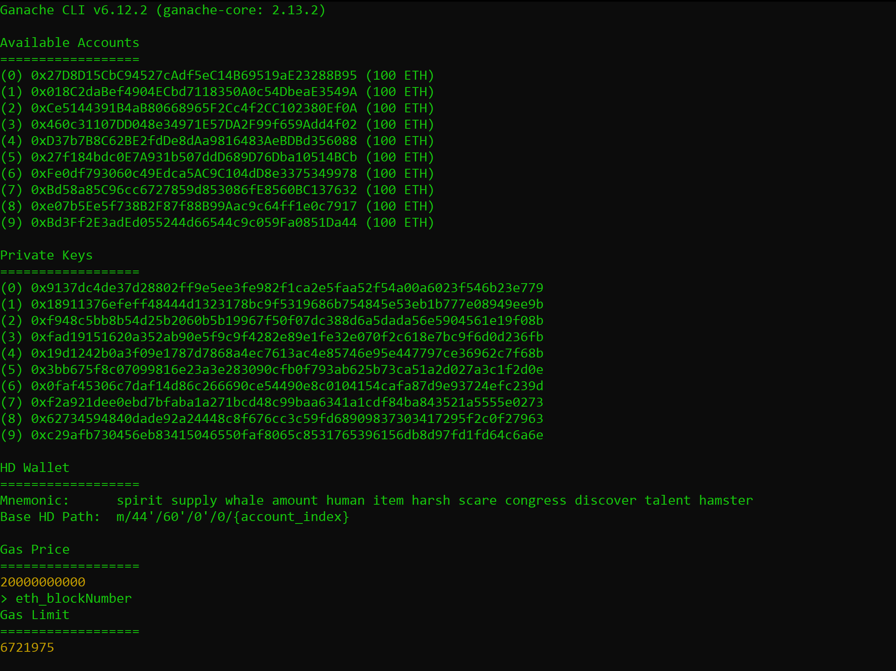

#### In a separate window run truffle compile and truffle migrate

    Run command: truffle test

#### Make sure metamask is enabled and set rinkeby network

    Run command: truffle migrate --reset --network rinkeby

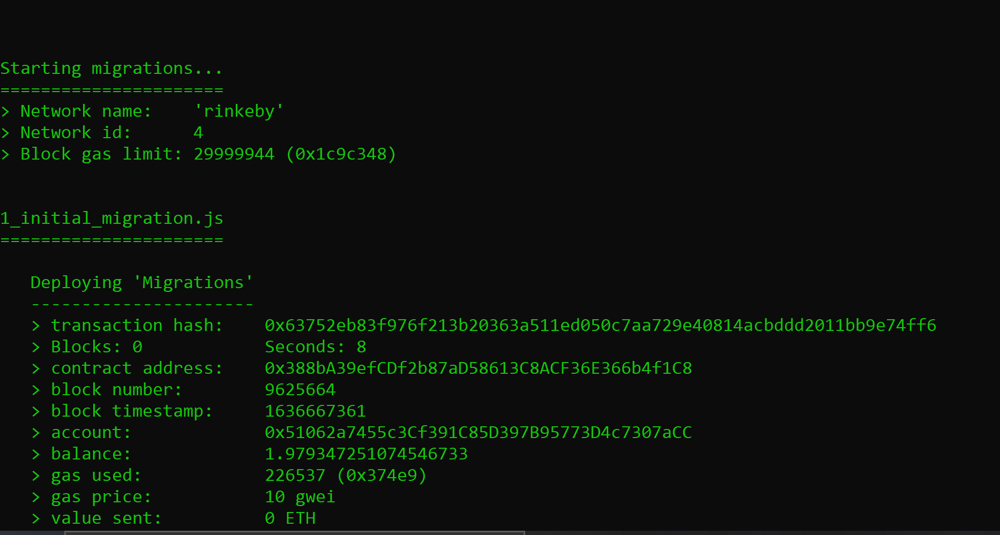

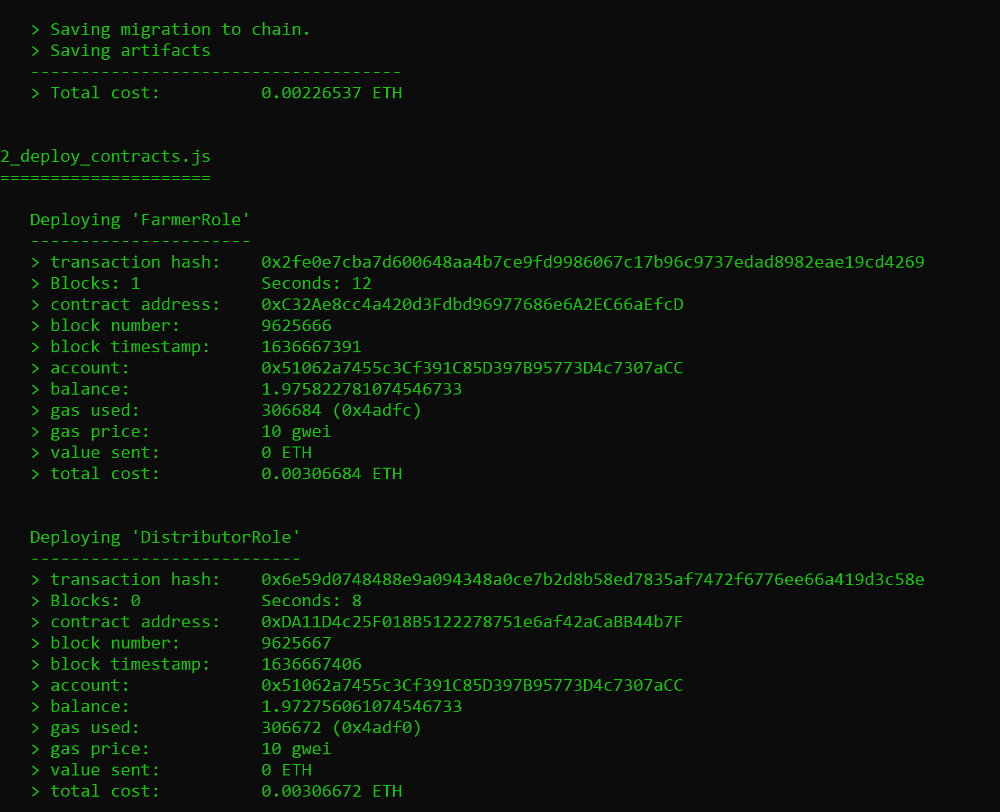

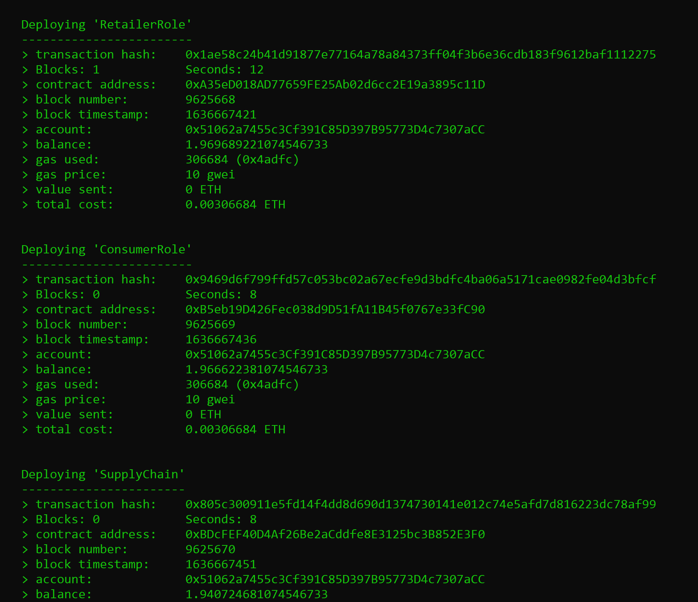

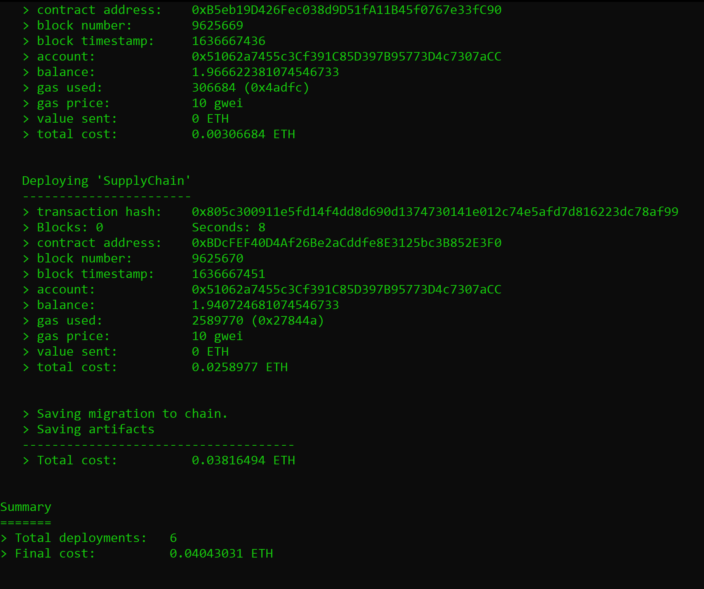

#### In a separate window run:
 
    npm run dev

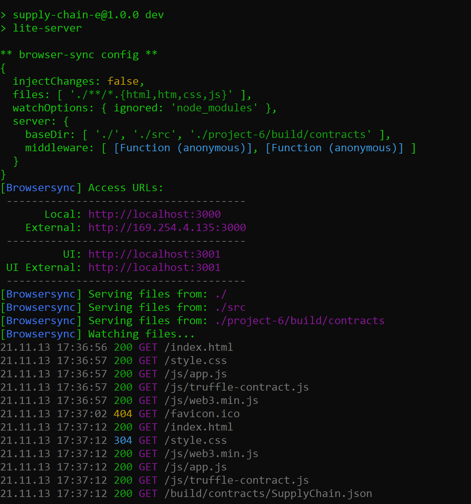

#### Front end Transaction history
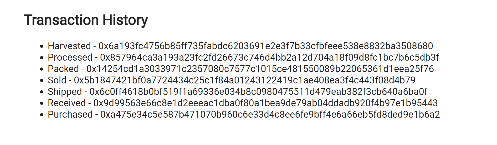

#### TransactionID and Contract Address
#### TransactionID : 0x805c300911e5fd14f4dd8d690d1374730141e012c74e5afd7d816223dc78af99
#### Contract Address : 0xBDcFEF40D4Af26Be2aCddfe8E3125bc3B852E3F0 
